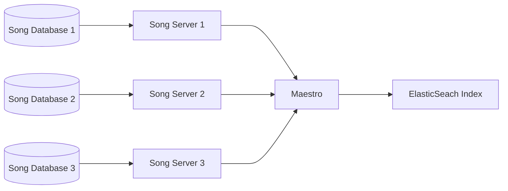

# Overview

## Introduction

Maestro's primary function is to organize data from multiple Song repositories into a single Elasticsearch index. By collecting data into a single index, Maestro allows upstream services, such as <a href="/documentation/arranger" target="_blank" rel="noopener noreferrer">Arranger</a>, to consume the data and expose it to end users for search and exploration.

# Key Features

- **Multi Repo Management:** Maestro offers built-in conflict detection and resolution. For instance, if multiple Song repositories identify the same file, Maestro detects this and aggregates the data from all sources into the Elasticsearch index.

- **Multiple Indexing Levels:** Song repositories have a standard hierarchy: **Repository > Study > Analysis**. Maestro can index at each level. For example, if you want to index all analyses within a specific study, you can supply Maestro with the following command:

    ```bash
    curl -X POST \
        http://localhost:11235/index/repository/`<repositoryCode>`/study/`<studyId>` \
        -H 'Content-Type: application/json' \
        -H 'cache-control: no-cache' \
    ```

- **Song Schema Support:** Song utilizes a core data model along with a flexible, user-defined dynamic schema, allowing administrators to define their data model rules. Maestro will require the base schema fields to index data but also supports the indexing of additional fields found within the dynamic schema.
 
- **Index Mapping Migrations:** When changes are introduced to the dynamic schema, the administrator(s) must update and migrate the new index mapping.

- **Exclusion Rules:** Specific data records may need to be excluded from indexing, for example, before a major data release, where records might need omission due to data integrity or legal concerns. Maestro also supports data publication controls by providing configurable exclusion rules to omit specific analyses from being indexed based on metadata tags assigned by Song. Study, Analysis, File, Sample, Specimen and Donor IDs can be used to exclude specific analyses.

- **HTTP or Kafka Indexing APIs** Maestro can process indexing requests via <a href="https://kafka.apache.org/" target="_blank" rel="noopener noreferrer">Apache Kafka</a> or through a standard JSON Web API (HTTP).

## System Architecture

Maestro's primary function is to organize data from multiple Song repositories into a single Elasticsearch index. By collecting data into a single index, Maestro allows upstream services, such as <a href="/documentation/arranger" target="_blank" rel="noopener noreferrer">Arranger</a>, to consume the data and expose it to end users for search and exploration.



## Repository Structure

```
.
├── /ci-cd
├── /maestro-app
├── /maestro-domain
└── /run/docker-compose
```

### maestro-domain

- This is the core features and framework independent logic that is portable and contains the main indexing, rules, notifications logic as specified by the business features. Has packages like:
    - entities : contains POJOs and entities
    - api: the logic that fulfills the business features
    - ports: contains the interfaces needed by the api to communicate with anything outside the indexing context.

### run/docker-compose

[explaination here]

### maestro-app

- This is the main runnable (spring boot app) it contains the infrastructure and adapters (ports implementations) that is needed to connect the domain with the outside world like elastic search, song web clients, configuration files etc. It also has the Spring framework configurations here to keep technologies outside of the domain.

## Integrations

Maestro integrates with the following software services:

| Service | Integration Type | Description |
|--|--|--|
| <a href="/documentation/song" target="_blank" rel="noopener noreferrer">Song</a> | Default | Maestro natively integrates with Song to index Song metadata into a single index. |
| <a href="https://www.elastic.co/" target="_blank" rel="noopener noreferrer">Elasticsearch</a> | Default | Maestro is designed to integrate with and build Elasticsearch indices by default. |
| <a href="https://kafka.apache.org/" target="_blank" rel="noopener noreferrer">Apache Kafka</a> | Optional |  Event-based indexing using the Kafka messaging queues. Maestro can also listen for and trigger indexing operations from specific Kafka topics |
| <a href="https://slack.com/" target="_blank" rel="noopener noreferrer">Slack</a> | Default | Slack notifications for index monitoring |